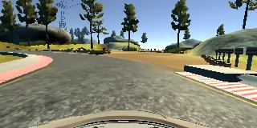
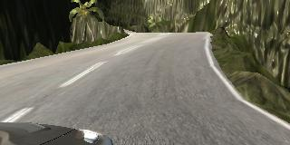
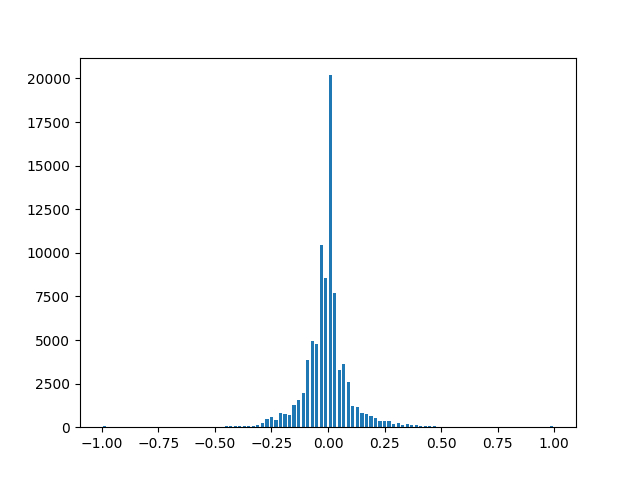
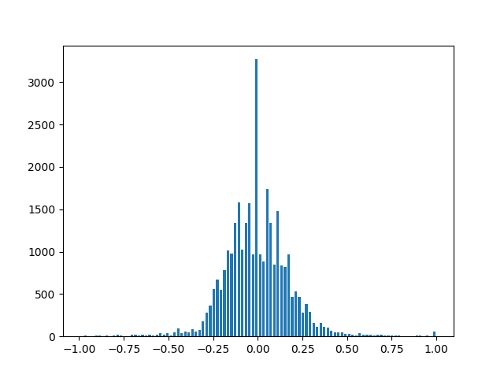

# Behaviorial Cloning Project

Overview
---
In this project, we train a Neural Network to steer a car in a driving simulation. The aim is for the NN to complete a lap around the track without leaving the driving lane. 

There are only two things we tweaked, the model architecture, and the data we use for training. Therefore, the NN goes directly from the data (images) to the output (steering) without us adding any specific knowledge to it.

Preface
---
As we started this project, we consulted the relevant slack channel for it, where we found a number of suggestions that we incorporated into our model from the beginning. 
* We made sure that we converted BGR to RGB.
* We spent a good amount of time obtaining more data, and driving the opposite way on the track.
* We started with a correction factor of +-0.20 for the side cameras.
* In drive.py we included a steering multiplier of 1.1.

The Data
---
Udacity provided us with a starting dataset for the project, of around 24k images. We added to it some 60k images, bringing the total to 86k data points. Below we can see an image from the first track (on the left) and from the second track (on the right).

The majority of our data comes from the first track, we added a couple laps from the second one towards the end to help the model generalize, but we probably need to collect many more if we want it to become robust.

One thing that was obvious from the beginning was that we would have many data points where the steering would be close to 0, and although we want to know when to drive straight, we do not want the model to overfit this scenario. Below we see the original distribution of our data set according to steering values.

In order to improve the performance of our model, and also to speed up the training, we decided to randomly drop some of the data points closer to 0. To do so, we split our data in a 100 bins, and for every bin where we had more than 1.5 times the average number of data points, we randomly took a sample of roughly that size. The resulting distribution was:

The Architecture
---
Our starting point was the Nvidia architecture, which we tweaked a little bit, by adding dropout layers and by changing some of the parameters. The result can be seen below: 

Our model starts by cropping large areas of the images, which are more likely to add noise than information, and we then half the size of the image. We have 5 convolution layers and 5 fully connected ones, as well as 3 dropout layers that were evenly spaced.

We use a generator to produce the batches we use for training. In the generator we augment the data by flipping all the images, and on top of that, we randomly modify each image, by either altering the hsv filter or by adding a shadow.

The Adam optimizer with a MSE loss function was used to train our network. We were constantly tweaking the number and sizes of the layers, as well as the other hyperparameters, and testing on the track to see whether it was capable of completing a lap. Before we started training we had already gathered most of the data we used, but we added a couple laps of the second track towards the end, which helped the model (although they were not enough to get it to drive on the second track in autonomous mode).

Result
---

We were able to train a network capable of driving around the first track at 30mph on the simulator. It is not robust yet to tackle the second track, but we plan to come back later with new ideas to see if we can get it to drive on the second one without using more data.

